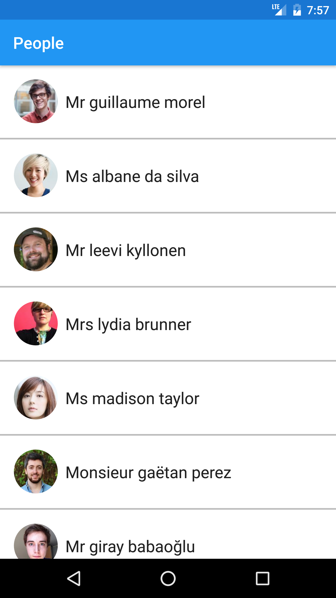

People
======

This GitHub repository contains the code of  People Android app. 
People is a demo application based on [RandomUser.me][1] API that shows the usage of Android Data Binding Library. 

[1]: https://randomuser.me/